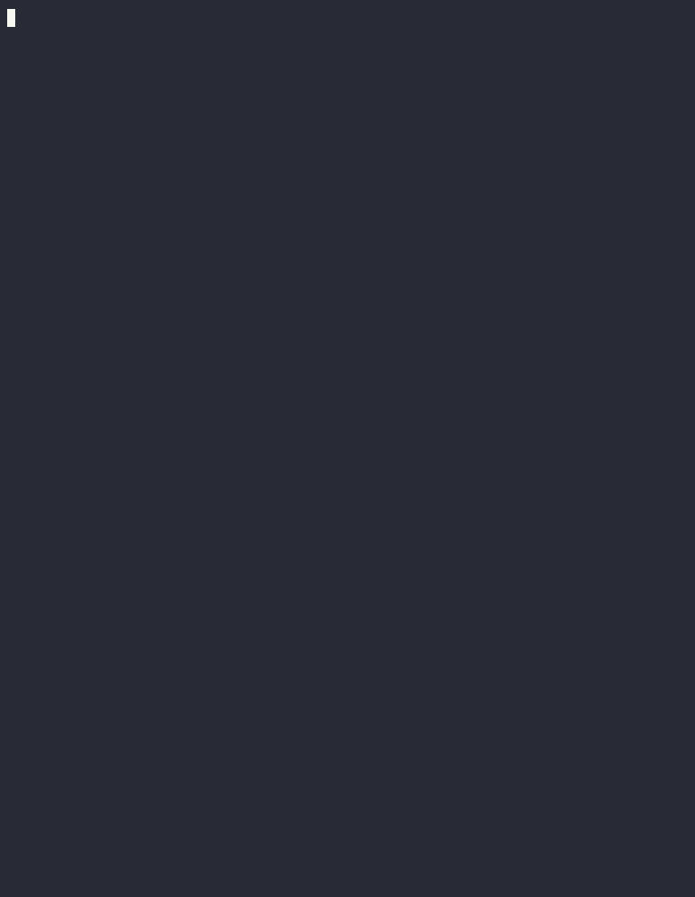

### Hexlet tests and linter status:
[](https://github.com/araslanov-e/go-project-244/actions)
[](https://github.com/araslanov-e/go-project-244/actions/workflows/ci.yml)

## Описание

`gendiff` — CLI-утилита, которая сравнивает два конфигурационных файла и показывает разницу между ними.

## Использование

Поддерживаются форматы JSON (`.json`) и YAML (`.yml`, `.yaml`); формат определяется по расширению файла.
Файлы могут содержать вложенные структуры — они сравниваются рекурсивно.

```bash
make build
./bin/gendiff testdata/fixture/nested1.json testdata/fixture/nested2.json
./bin/gendiff --format stylish testdata/fixture/nested1.yml testdata/fixture/nested2.yaml
```

Формат вывода задаётся флагом `--format` (`-f`). По умолчанию используется `stylish`:
`+` — добавленное значение, `-` — удалённое, без знака — значение не изменилось.

### Формат plain

Формат `plain` выводит по строке на каждое изменённое свойство с полным путём от корня:

```bash
./bin/gendiff --format plain testdata/fixture/nested1.json testdata/fixture/nested2.json
```

```
Property 'common.follow' was added with value: false
Property 'common.setting2' was removed
Property 'common.setting3' was updated. From true to null
Property 'group1.nest' was updated. From [complex value] to 'str'
...
```

Составные значения (объекты и массивы) выводятся как `[complex value]`, строки — в одинарных кавычках,
числа, `true`, `false` и `null` — как есть.

## Демо

Все форматы вывода (`stylish` и `plain`):


